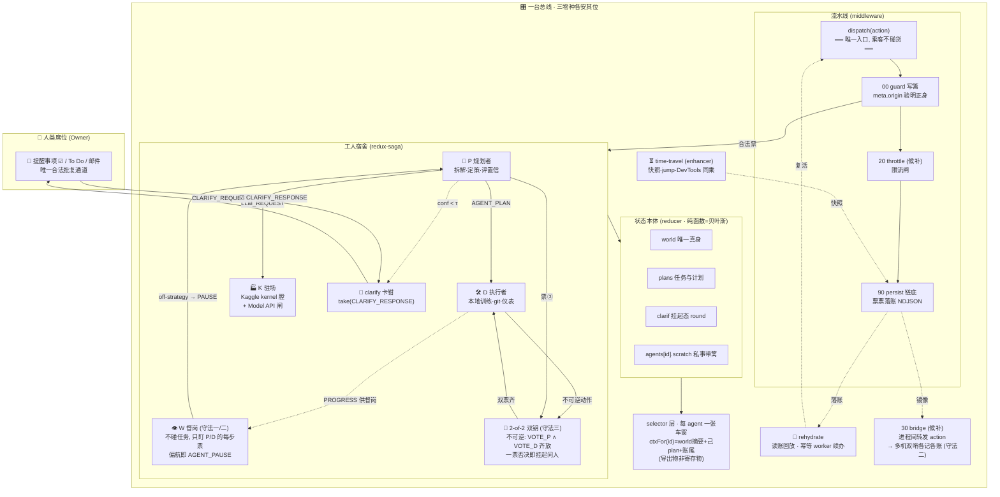

# Orchestra · 提案 #2/#3 的 PoC（2026-09-19, owner×Qwen 晨议）

**命题**（主人原话摘要）: 用前端成熟的 **Redux + redux-saga** 编排多 agent 工作,
以**持久层**保通讯数据; agent 上下文亦经此架构获得。

**本 PoC 证明了什么** (两幕剧, 输出实录见 git log 2026-09-19):
- store = 共享信念状态; **agent 的 context 即 state 的 selector 视图** (提案#3 落地)
- saga = agent 工人 (计算工/归档工), 纯 action 驱动, 互相不知存在
- 持久中间件居链底: **任何 action (含 saga 内部 put) 都落 NDJSON 账本, 无一能绕** —
  这正是园区"证据不朽"律的运行时形态; 崩溃后重放=复活续办, 归档恰三件不重不漏
- crash-mid 幕: spring 死于飞行中, 账本只剩 2 行 → 复活幕自动 resume — **幂等 worker 是关键**

**与园区既有律法的对位表**
| Redux 概念 | 园区旧识 |
|---|---|
| action log (NDJSON) | letters/ + kanban intent (append-only) |
| reducer 纯函数 | 贝叶斯更新 (Host 不猜测只更新) |
| store 状态 | 雷荷波信念态 (POMDP belief 的具身) |
| saga 工人 | benches 各 agent; 前端成熟件 = DevTools 时间旅行白送 |
| 持久层 | "每个数字必须有字节文件" 律 |

**边界与限度**: redux-saga 是编排不是仲裁 — 跨机分布需换 redux + 事件源后端
(如 NATS/SQLite); 单进程版足以统御本园五 bench 的调度野心; 与 Temporal/AutoGen
的重叠处先以"零新组件"为原则搁置。

下一步 (候主人圈点): 把 chora/experiments 的 Kaggle runner 包成 saga 工人, bus 即园区总机。

---

# ORCHESTRA 框架志（v0.2 骨架已立, 18:11 两幕剧 v2 全绿）

## 解剖图 —— Redux 扩展只有三种物种, 别混
| 物种 | 挂在哪 | 本园成员 |
|---|---|---|
| **middleware** | dispatch 流水线 | guard(00) · saga(10) · persist 写端(90) |
| **store enhancer** | store 本体 | **time-travel**（正解在此, 非中间件）· persist 读端(rehydrate) · DevTools |
| **selector** | 订阅侧 | per-agent 上下文切片 = 渐进披露的唯一读出口 |

「持久层」是一对鸳鸯腿：写端 middleware（链底收票）+ 读端 rehydrate（回放造种子）——单挂一半只能记账不能复活。

## 插座表（00→99, 越靠前越早见票; 每件自带过肩测试+保险丝）
```
00 guard      身份写篱: meta.origin ∉ 名单 → 拒账留审计 (今日实测拒 hacker ✔)
10 saga       P/D/K 工人宿舍
20 throttle   (候) 限流闸
30 bridge     (候) 进程间总线 —— 多机园区
90 persist    链底账本 NDJSON
```

## 上下文铁律（主人方案的定案）
**state.world/plans/clarif = 唯一真身; agents[id].scratch = 私事带篱; 各 agent 的“那一份上下文”由 selector 现切, 不存副本。**
存副本=多本真相=迟早对账打架；切视图=一份真相 N 张车窗。（POMDP 语：belief 共享，观测各自投影。）

## 加件规矩
新中间件三件套：`tests/` 过肩测试、本表登记、可拔保险丝。一次一件, 砸完一颗核桃再上座。

---

## 全生命周期总图（mermaid · 2026-09-19 版）

```mermaid
flowchart TD
  subgraph OWNER["👤 主人 · 四屏"]
    PH["📱 提醒事项 + To Do·Concept-Space<br/><b>☑ = 批复</b> (勾掉即圣旨)"]
    EM["📧 邮件 CMS + 园匣<br/>(读物/回执)"]
    NA["📝 Apple Notes 日报<br/>(回看)"]
    ON["📓 OneNote 分区<br/>(归档)"]
  end

  TRIG{{"⏰ launchd 双巡<br/>08:00 晨圈 · 21:00 夜报"}}
  SAY(["🗣 对话即入口<br/>主人一句话 = 一次 dispatch"])

  subgraph BUS["🎛 ORCHESTRA 总机 (Redux 总线)"]
    direction TB
    D0["dispatch(action)"]
    G["00 guard · 写篱<br/>meta.origin ∉ 名单 → 拒账留审计"]
    SG["10 saga · 工人宿舍"]
    PP["P 规划者 · 前额叶<br/>拆解 / 置信度判定"]
    DD["D 执行者 · 感觉运动<br/>本地 MPS / 训练 / git"]
    KK["K 驻场 · Kaggle 代理<br/>kernel 批产 + LLM API"]
    CF["clarify 刹车<br/>take(CLARIFY_RESPONSE) 挂起全流水线"]
    PR["90 persist · 链底账本<br/>NDJSON 票票过闸"]
    TT["⏳ time-travel (enhancer)<br/>快照 · jump"]
    RH["🔁 rehydrate (读端)<br/>回放账本 → 复活续办"]
    SEL["selector · 每 agent 上下文切片<br/>(导出物, 非寄存物 · 渐进披露)"]
  end

  subgraph KAG["🏭 Kaggle 工马场 (30h T4/周)"]
    Q["夜哨 v3 · ≤2 局滚动<br/>一次闸 pushed1 · REPORT_LINE 直读"]
    KN["kernel 膛: qwen15→…→xdom/atlas<br/>(自包含核 + 疫苗 + 挂载镜像)"]
    RP["战报 report_*.json"]
  end

  subgraph PAPER["📜 文案与账房 (园区律)"]
    PRE["PREREG 先行<br/>(假说/判据/偏差申报)"]
    ART["artifacts + manifest 四向校验<br/>sha 即收据"]
    BRD["看板 experiments.json<br/>lane 由字节推导"]
    GIT["commit = 收据 · 耐心推 3+10/20/40"]
    LTR["letters/ 031… 信使"]
  end

  SAY --> D0
  TRIG --> D0
  D0 --> G --> SG
  SG --> PP
  PP -->|"confidence ≥ τ"| DD
  PP -->|"重计算外包"| KK
  PP -->|"confidence < τ · 红线必问"| CF
  CF -->|"挂起: 三屏同呈问题"| PH
  PH -->|"☑ 批复 = CLARIFY_RESPONSE"| CF --> PP
  DD & KK --> Q --> KN --> RP
  RP --> ART
  DD --> ART
  SG -.每一票.-> PR
  PR -.账本.-> RH -.复活.-> D0
  TT -. -.-> PR
  BUS --> SEL
  ART --> BRD --> GIT
  ART --> LTR
  BRD --> TRIG
  GIT & LTR -->|"夜巡汇编"| EM & NA & ON
  ART -.缺口/战况.-> PH
```

读图口诀：**一票入门（guard）、两路工马（本地/Kaggle）、三问刹车（clarify→☑）、四账归底（persist/rehydrate）、五屏同光（提醒·邮件·备忘·Note·玻璃）**。

---

## Redux-multiagent 总图（多智能体宪法 · 2026-09-19）



**站岗四法注**（图上四件岗哨）：守法一 `WDG 督岗`=P盯D每一步；守法二 `BRG 双哨`=多机各记各账、对账验真（共享班次表不共享记事本）；守法三 `KEY 双钥`=红线动作两票连署；守法四=双 worker 同速影子（金贵岗位才配, 未画）。

宪法四条：**乘客不碰货（一切经 dispatch）· 写要验身（guard）· 票票有根（persist）· 上下文看车窗不搬货（selector）**。
